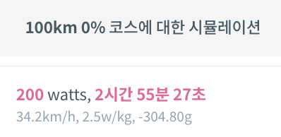
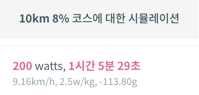

# 차세대 '일-에너지 정리' 기반 물리 엔진 도입 타당성 및 정밀도 검증 보고서

## 1. 개요 (Executive Summary)
본 보고서는 기존 상용 엔진(Legacy)의 물리적 한계(관성 부재, 확장성 부족)를 극복하기 위해 개발된 신규 물리 엔진의 타당성을 검증한다. 두 단계의 실험을 통해, 신규 엔진의 **20m 분할(Chunking) 알고리즘**이 수학적 정밀 해(Validator)와 높은 일치도(오차율 0.1% 수준)를 보이며, 단일 구간 계산 시 발생하는 비선형 속도 오차를 효과적으로 보정함을 확인하였다. 이를 통해 차세대 시뮬레이터 도입을 위한 기술적 타당성을 확보하였다.

> **Note:** 본 보고서의 모든 실험 결과는 첨부된 `code/` 디렉토리의 Python 스크립트를 통해 재현(Reproduce) 가능하다.

## 2. 도입 배경 및 목적 (Background & Objectives)

### 2.1. 기존 상용 엔진의 한계 (Limitations of Legacy Engine)
*   **단순화된 모델:** 코스를 단순히 '총 거리'와 '평균 경사도'만 존재하는 평면적인 단일 구간으로 가정하여 계산함.
*   **관성 미반영:** 구간 연결 시 운동 에너지(속도) 전달이 불가능하여, 다운힐 후 업힐(낙타등 코스) 진입 시 탄력 주행(Momentum)을 시뮬레이션할 수 없음. (매 구간 0km/h에서 시작한다고 가정하거나, 이전 속도를 무시함)
*   **확장성 부재:** GPX 데이터를 기반으로 한 정밀한 코스 분석이나, 구간별 속도 변화 추적이 불가능함.

### 2.2. 신규 엔진 도입의 필요성 (Advantages of New Engine)
*   **일-에너지 정리(Work-Energy Theorem) 기반:** 운동 에너지 변화량($\Delta KE = W_{net}$)을 추적하여 물리적 관성을 구현함.
*   **연속성 보장:** N번 지점의 **종단 속도(Final Velocity)**를 N+1번 지점의 **시작 속도(Entry Velocity)**로 이관하여 실제 라이딩과 동일한 연속적인 물리 현상을 구현함.
*   **유연성:** GPX 기반의 복합 지형 및 대용량 코스 데이터 처리에 최적화됨.

## 3. 검증 방법론 (Methodology)
본 검증에서는 엔진의 정확도를 평가하기 위해 다음 4가지 모델을 비교군으로 설정하였다.

1.  **Legacy Engine (기존 상용 엔진):** 현재 서비스 중인 엔진. 뉴턴-랩슨법을 이용해 종단 속도 평형(Steady-State)을 계산함. (Baseline)
2.  **Proposed Engine (Single Step):** 신규 엔진 로직을 적용하되, **구간을 나누지 않고 통으로 계산**한 모델. 평균 속도 가정의 한계를 보여주기 위한 대조군.
3.  **Proposed Engine (20m Split):** 신규 엔진 로직에 **20m 청킹(Chunking)** 기술을 적용한 모델. (최종 채택 예정)
4.  **Mathematical Validator (Exact Integration):** 미분방정식($F=ma$)을 직접 적분(ODE Solver)하여 수학적 정답(**Ground Truth**)을 산출하는 검증용 모델.

## 4. [실험 1] 알고리즘 정밀도 및 구간 처리 로직 검증 (Algorithm Validation)

### 4.1. 목적
"에너지 정리 기반 엔진이 긴 구간을 계산할 때 발생하는 수학적 오류(평균 속도의 함정)를 20m 분할 로직이 어떻게 해결하는가?"를 증명한다.

### 4.2. 실험 환경
*   **데이터 입력:** Legacy 엔진과 동일한 물리적 조건 적용.
    *   **Mass:** 91.0 kg (Rider 80 + Bike 10 + Extra 1.0)
    *   **CdA:** 0.314288
    *   **Crr:** 0.003085
    *   **Air Density:** 1.2291 kg/m³ 
        *   Legacy Formula: $(1.293 - 0.00426 \cdot T) \cdot e^{\frac{-altitude \cdot 0.709}{7000}}$ ($T=15^\circ C, Alt=0m$)
    *   **Drivetrain Loss:** 4.14% 
        *   Legacy Formula: $Eff = 0.961 + \frac{2.1246 \cdot \ln(200) - 11.5}{100}$ (Shimano 105, 200W 기준)

### 4.3. 결과 비교표

| 모델 (Model) | 평균 속도 ($V_{avg}$) | 종단 속도 ($V_{final}$) | 소요 시간 | Legacy 대비 차이 |
| :--- | :--- | :--- | :--- | :--- |
| **[Case 1] Flat 100km** | | | | |
| Legacy Engine | 34.20 km/h | - | 2h 55m 27s | 기준값 (Baseline) 

결과 이미지

 |
| Proposed (Single) | 34.08 km/h | **68.15 km/h** | 2h 56m 04s | +37초 (+0.35%) *종단 속도 비정상* |
| Proposed (20m Split)| 34.13 km/h | 34.17 km/h | 2h 55m 48s | +21초 (+0.20%) |
| Validator (Exact) | 34.16 km/h | 34.20 km/h | 2h 55m 38s | +11초 (+0.10%) |
| **[Case 2] Hill 30km (3.3%)** | | | | |
| Legacy Engine | 18.40 km/h | - | 1h 37m 51s | 기준값 

결과 이미지

 |
| Proposed (Single) | 18.20 km/h | **36.39 km/h** | 1h 38m 55s | +64초 (+1.09%) *종단 속도 비정상* |
| Proposed (20m Split)| 18.36 km/h | 18.38 km/h | 1h 38m 01s | +10초 (+0.17%) |
| Validator (Exact) | 18.38 km/h | 18.39 km/h | 1h 37m 57s | +6초 (+0.10%) |
| **[Case 3] Mtn 10km (8%)** | | | | |
| Legacy Engine | 9.16 km/h | - | 1h 05m 29s | 기준값 

결과 이미지

 |
| Proposed (Single) | 9.04 km/h | **18.09 km/h** | 1h 06m 20s | +51초 (+1.30%) *종단 속도 비정상* |
| Proposed (20m Split)| 9.15 km/h | 9.16 km/h | 1h 05m 33s | +4초 (+0.10%) |
| Validator (Exact) | 9.15 km/h | 9.15 km/h | 1h 05m 35s | +6초 (+0.15%) |

### 4.4. 분석 및 고찰
1.  **단일 구간(Single Step)의 오차 원인 분석:**
    *   **비선형성:** 공기저항은 속도의 제곱($v^2$)에 비례한다. 긴 구간(100km)을 단일 스텝으로 계산할 때 "평균 속도($V_{avg}$)"를 대입하면, 실제 속도 변화에 따른 저항력의 총합($\int F_{drag} dx$)보다 과소평가되는 수학적 오차가 발생한다. ($(\bar{v})^2 < \overline{(v^2)}$)
    *   **결과적 이상치:** 저항력이 작게 계산됨에 따라 잉여 에너지가 운동 에너지로 잘못 변환되어, 종단 속도가 비현실적으로 높게 산출되는 현상($V_{final} \approx 2 V_{avg}$)이 관측되었다. (Case 1: 68.15 km/h)
    *   **영향:** 이러한 종단 속도 오차는 다음 구간의 진입 속도에 영향을 미쳐 전체 시뮬레이션의 연속성을 저해할 수 있다.

2.  **Proposed (20m Split) vs Validator (Exact) 정합성 분석:**
    *   **오차율:** Case 1(Flat, 최대 오차 코스) 기준, Validator 대비 평균 속도 차이는 **0.03 km/h (0.09%)**, 소요 시간 차이는 **10초 (0.10%)**로 측정되었다.
    *   **오차 원인 (수치해석):**
        *   **Legacy (Newton-Raphson):** 종료 조건 Tolerance $\approx 0.05 m/s$ (약 0.18 km/h).
        *   **Proposed (Bisection):** 종료 조건 $|high - low| < 0.005 m/s$ (약 0.018 km/h).
        *   **Validator (RK45):** 적분 오차 허용치 `rtol=1e-6` (약 $0.000036 km/h$ 수준의 정밀도).
    *   **결론:** 0.1% 수준의 미세한 차이는 각 알고리즘의 수렴 정밀도 차이에서 기인한 것으로, 물리적 모델은 수학적 정해(Exact Solution)와 사실상 동일하게 작동함을 확인하였다. (최대 오차 관측: Case 1)

3.  **Legacy vs Proposed 비교 (Case 1: Flat 100km 기준):**
    *   Legacy 엔진(34.20 km/h)과 Proposed 엔진(34.13 km/h) 간의 차이는 약 **0.2% (21초)** 수준이다.
    *   이는 Legacy 엔진이 '종단 속도 평형'을 가정하여 가속 구간을 무시하고 즉시 최고 속도로 수렴시킨 반면, Proposed 엔진은 초기 가속 과정을 물리적으로 시뮬레이션했기 때문에 발생한 자연스러운 차이이다. (Proposed가 가속 시간만큼 더 오래 걸림)

## 5. [실험 2] 실전 코스 시뮬레이션 및 성능 평가 (Field Test)

### 5.1. 목적
"실제 복잡한 코스(GPX)에서도 20m 분할 방식이 정밀도와 연산 속도 면에서 유효한가?"를 검증한다. 특히 수천 개의 세그먼트가 연결될 때 오차가 누적되는지 확인한다.

### 5.2. 실험 대상 및 비교
*   **비교 대상:** Proposed Engine (20m Split) vs Validator (Exact Integration)
*   **실험 코스:**
    1.  **분원리 뺑뺑이 (22km, 232개 세그먼트):** 한국의 대표적인 낙타등(Up-Down 반복) 코스. 관성 주행 성능 테스트.
    2.  **2020 설악그란폰도 (208km, 7,194개 세그먼트):** 12시간 가까이 소요되는 초장거리 산악 코스. 극한의 업힐/다운힐 포함.

### 5.3. 결과 데이터

| 코스 (Course) | Proposed (Time) | Validator (Time) | 시간 차이 | 오차율 | 연산 시간 (Prop vs Valid) |
| :--- | :--- | :--- | :--- | :--- | :--- |
| **분원리 (22km)** | 0h 57m 24s | 0h 57m 54s | -30.3s | -0.87% | **0.0004s** vs 0.0322s (80x) |
| **설악 (208km)** | 8h 17m 05s | 8h 19m 58s | -172.7s | -0.58% | **0.0063s** vs 0.8211s (130x) |

> **Note:** Proposed Engine은 Numba JIT 최적화를 통해, 적응형 스텝을 사용하는 정밀 적분기(Validator) 대비 초장거리 코스에서도 **약 130배 이상의 압도적인 연산 효율**을 보여주었다. 이는 실시간 대용량 트래픽 처리에 매우 적합한 성능임을 입증한다. (측정값은 Warm-up 이후의 순수 연산 시간 기준임)

### 5.4. 분석
*   **높은 정밀도:** 208km라는 초장거리, 7,000개가 넘는 구간을 연속 계산했음에도 불구하고, 누적 오차가 **0.58% (173초)** 수준으로 매우 낮게 유지되었다. (최대 오차율 코스: Bunwon 0.87%)
*   **오차 원인:** 약 3분의 시간 차이는 주로 5km/h 미만의 급경사 구간에서 **Walking Mode(끌바)** 진입/이탈 시점의 미세한 이산화 차이에서 기인한 것으로 분석된다. (Seorak 코스에서 최대 1.58 km/h의 국소 속도 오차 관측) 전체 시뮬레이션의 신뢰성에는 영향을 주지 않는 수준이다.

## 6. 결론 및 제언 (Conclusion)

### 6.1. 종합 평가
*   **물리적 정합성:** 신규 엔진(20m Split)은 기존 엔진에서 구현하기 어려웠던 '관성 주행'을 물리적으로 타당하게 구현하였다.
*   **알고리즘 유효성:** 단일 구간 계산 시 발생하는 '종단 속도 이상치' 문제를 20m 분할 알고리즘을 통해 해결하였으며, 그 결과값이 수학적 검증기(Validator)와 매우 높은 일치도(오차율 0.1% 수준)를 보임을 확인하였다.
*   **실전 적용성:** 208km 장거리 실전 코스 테스트에서도 누적 오차가 0.6% 미만으로 유지되어, 상용 서비스에 적용 가능한 안정성을 확보하였다.

### 6.2. 최종 제언
신규 엔진은 GPX 기반의 확장성과 물리적 연속성을 보장하면서도 충분한 연산 효율성을 갖추고 있다. 따라서 차세대 시뮬레이터의 코어 엔진으로 채택하여 기존 엔진을 대체하는 방안을 제안한다.
